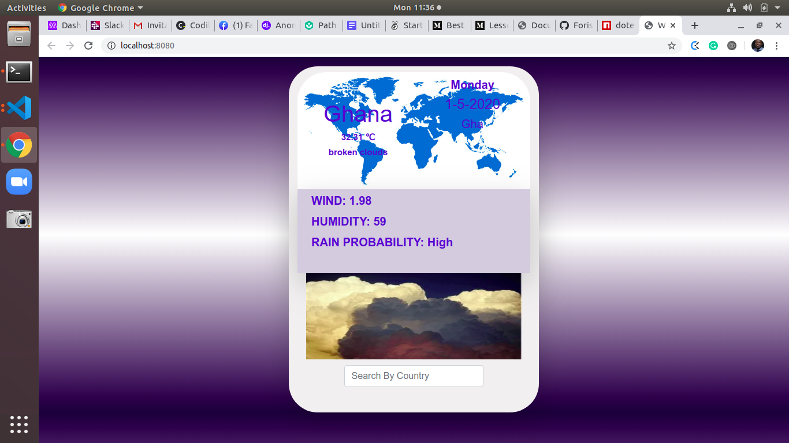

# weatherApp 

A practical demonstration of designing an app that giveS weather info by searching by country names with javascript(webpack) and the weather API
The project is part of a series of projects to be completed by students of [Microverse](https://www.microverse.org/ "The Global School for Remote Software Developers!").

## Technologies

- HTML
- CSS
- Javascript
- webpack

## Usage

> Clone the repository to your local machine

```sh
$ git clone https://github.com/forison/weatherApp.git
```

> cd into the directory

```sh
$ cd simpleRestaurantPage
```
> git clone https://github.com/forison/weatherApp

``` 
cd weatherApp 
```
```
 npm install
```
```
npm watch
```
```
npm start
```
```
open with your favourite web browser.
```

## Designed and developed by

[Boakye Addo Forison](https://github.com/Forison)


## Contributing

1. Fork it (https://github.com/forison/simpleRestaurantPage/fork)
2. Create your feature branch (git checkout -b feature/[choose-a-name])
3. Commit your changes (git commit -am 'What this commit will fix/add')
4. Push to the branch (git push origin feature/[chosen name])
5. Create a new Pull Request